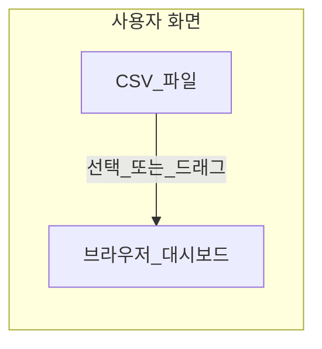

# 게시판 대시보드 사용 안내

웹 브라우저에서 열리는 **고객센터 1:1 문의 종합 대시보드** 사용법입니다. CSV를 올리면 **내 PC 안에서** 집계·차트가 만들어지며, 회사에서 안내한 주소로 접속해 사용합니다.

---

## 목차

1. [이 대시보드로 할 수 있는 일](#1-이-대시보드로-할-수-있는-일)
2. [접속 방법](#2-접속-방법)
3. [데이터 올리기(CSV)](#3-데이터-올리기csv)
4. [기간 나누어 보기](#4-기간-나누어-보기)
5. [채널(탭) 바꾸기](#5-채널탭-바꾸기)
6. [화면에서 보는 것들](#6-화면에서-보는-것들)
7. [요약 레포트·AI 요약](#7-요약-레포트ai-요약)
8. [자주 묻는 것 / 안 될 때](#8-자주-묻는-것--안-될-때)
9. [AI 결과를 쓸 때 주의](#9-ai-결과를-쓸-때-주의)

---

## 1. 이 대시보드로 할 수 있는 일

- 게시판에서 받은 **문의 CSV**를 넣고, **기간**과 **채널(1:1, 한줄평, 기타, 학습, 상품)**별로 건수·비율·추이를 봅니다.
- 차트를 눌러 **상세 목록**을 열어 제목·내용·답변을 확인합니다.
- (환경이 갖춰진 경우) **요약 레포트**와 목록 **AI 요약**으로 빠르게 흐름을 파악합니다.

CSV는 **서버로 자동 업로드되지 않습니다.** 브라우저가 파일을 읽어 그 PC에서만 분석합니다.

---

## 2. 접속 방법

회사 또는 담당자가 알려준 **웹 주소**를 크롬·엣지 등으로 여세요.

- 예: 내부에서 배포한 주소, 또는 `https://…github.io/…/cs-dashboard.html` 형태의 주소일 수 있습니다.
- 주소는 조직마다 다릅니다. 모르면 **담당자에게 접속 URL**을 요청하세요.

---

## 3. 데이터 올리기(CSV)

1. 화면 **왼쪽 사이드바** 맨 위 **점선 박스**를 클릭하거나, CSV 파일을 그 위로 **끌어다 놓습니다**.
2. 한 번에 여러 파일을 선택할 수 있습니다.

아래 **파일 이름**이 맞아야 자동으로 채널에 연결됩니다.

| 파일 이름     | 대시보드에서 부르는 이름 |
|---------------|--------------------------|
| `1on1.csv`    | 1:1문의                  |
| `comment.csv` | 한줄평                   |
| `etc.csv`     | 기타 문의                |
| `learning.csv`| 학습질문                 |
| `product.csv` | 상품문의                 |

이름이 다르면 인식이 안 될 수 있으니, 게시판에서 받은 파일명을 그대로 쓰거나 담당자 안내에 맞춰 주세요.  
사이드바 아래 작은 표시로 **어떤 파일이 이미 들어왔는지** 대략 확인할 수 있습니다.

---

## 4. 기간 나누어 보기

1. 왼쪽 **기간 설정**에서 **시작일**, **종료일**을 고릅니다.
2. **조회 적용**을 눌러야 차트·숫자·레포트에 반영됩니다.
3. **전체 기간** / **최근 30일** 버튼으로 빠르게 바꿀 수 있습니다.

---

## 5. 채널(탭) 바꾸기

화면 위쪽의 **1:1문의 · 한줄평 · 기타 문의 · 학습질문 · 상품문의** 버튼을 누르면 해당 채널만의 대시보드로 바뀝니다.  
각 버튼 옆 숫자는 **현재 기간·조건에 맞는 건수**입니다.

---

## 6. 화면에서 보는 것들

채널마다 조금씩 다르지만, 공통적으로 다음을 볼 수 있습니다.

- **총 건수**, **답변 소요 시간**, **답변 완료율** 등 요약 숫자  
- **유형 비중**, **일별 접수 추이** 등 차트  
- 1:1 문의에서는 **배송·교환·반품 키워드**, **최근 문의**, **지연 응대** 같은 목록  

차트는 **휠로 확대**, **드래그로 이동**할 수 있는 곳이 있습니다. **줌 초기화**로 원래 크기로 돌릴 수 있습니다.

막대·셀·도넛 등을 **클릭**하면 그 조건에 맞는 **문의 목록 모달**이 열리는 경우가 많습니다. 모달 안에서 제목·내용·답변을 스크롤해 읽을 수 있습니다.

**학습질문** 탭에서는 **교재 하나**를 고른 뒤 **페이지 × 문항** 격자를 볼 수 있습니다. 격자의 칸을 누르면 해당 위치의 질문들이 모달로 열립니다.

**학습질문·상품문의**에서는 **상품명(교재명)** 범위를 좁혀서 볼 수 있습니다. 화면 안내에 따라 **더보기·검색**, **전체 선택 / 해제** 등을 사용하세요.

---

## 7. 요약 레포트·AI 요약

### 토탈 레포트 생성하기

- 위치: **왼쪽 사이드바**, 기간 설정 아래쪽의 크고 눈에 띄는 버튼입니다.
- **지금 사이드바에 맞춰 둔 기간**으로, **다섯 채널을 한꺼번에** 묶어 본 요약 레포트 창이 열립니다.

### 레포트 생성하기

- 위치: **가운데 본문** 상단, 현재 탭 제목 근처의 어두운 버튼입니다.
- **지금 선택된 탭(채널) 하나**와 **같은 기간**만 반영합니다.

### AI 요약하기

- **문의 목록이 열린 창(모달)** 안에 있습니다.
- 목록이 비어 있으면 사용할 수 없습니다.
- 누르면 **잠시 기다린 뒤**(수십 초~1~2분도 될 수 있음) 아래쪽에 요약 글이 채워집니다.

레포트·요약이 **안 되거나 오류 문구**가 나오면, [8절](#8-자주-묻는-것--안-될-때)을 보고, 필요하면 **담당자에게** 알려 주세요. (접속 주소·AI 서버는 조직에서 관리하는 경우가 많습니다.)

---

## 8. 자주 묻는 것 / 안 될 때

**Q. 숫자가 전부 0이에요.**  
→ CSV를 올렸는지, 파일 이름이 위 표와 같은지 확인하세요. 기간을 너무 좁게 잡았는지도 봅니다.

**Q. 차트가 이상해요.**  
→ **조회 적용**을 누른 뒤인지 확인하세요. 한글 깨짐은 CSV 저장 형식(UTF-8 등) 문제일 수 있어 담당자에게 파일 예시를 문의하세요.

**Q. AI 요약·레포트만 실패해요.**  
→ 조직에서 **AI까지 쓰는 주소**로 열었는지 확인하세요. 웹에서만 쓰는 주소라면 담당자가 안내한 **별도 접속 방법**(예: 사내에서만 열기)이 있을 수 있습니다.  
→ **첫 실행만** 한참 걸리는 서비스도 있으니, 1~2분 기다린 뒤 한 번 더 시도해 보세요.

**Q. 파일을 올리면 개인정보가 밖으로 나가나요?**  
→ 이 대시보드는 기본적으로 **브라우저가 파일을 읽어 그 PC에서 계산**합니다. 조직 정책이 따로 있으면 내부 안내를 따르세요.

---

## 9. AI 결과를 쓸 때 주의

- AI가 만든 문장은 **참고용**입니다. 보고·이관·고객 회신 전에 **원문(목록·CSV)**과 꼭 맞는지 확인하세요.
- 수치나 사실 관계는 **화면에 나온 표·건수**를 기준으로 삼는 것이 안전합니다.

---

문의는 내부 담당자 또는 저장소 관리자에게 연락해 주세요.
